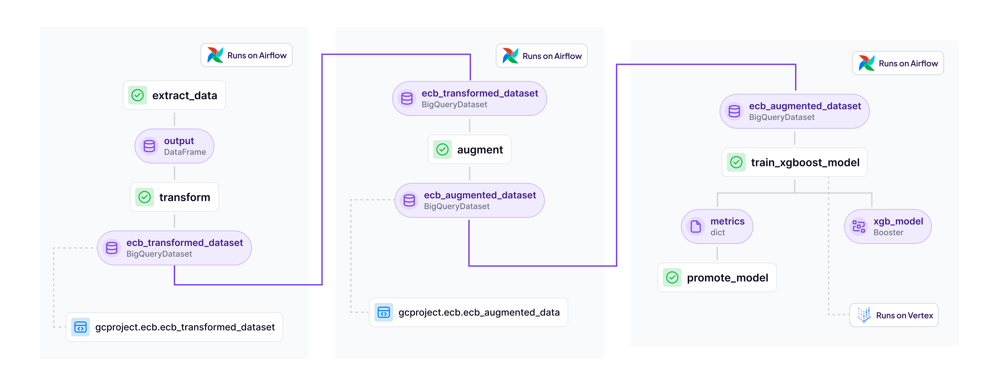

# EuroRate Predictor

Turn European Central Bank data into actionable interest rate forecasts with this comprehensive MLOps solution.

## 🚀 Product Overview

EuroRate Predictor is a production-ready MLOps solution that transforms raw European Central Bank (ECB) interest rate data into accurate forecasts to inform your financial decision-making. Built on ZenML's robust framework, it delivers enterprise-grade machine learning pipelines that can be deployed in both development and production environments.



### Key Features

- **End-to-End MLOps Pipeline**: From data extraction to model deployment
- **Cloud-Ready Architecture**: Seamlessly runs on Google Cloud Platform
- **Flexible Deployment Options**: Development mode for quick iteration, Production mode for enterprise deployment
- **Automated Model Evaluation**: Ensures only high-quality models are promoted to production
- **Scalable Infrastructure**: Leverages Airflow and Vertex AI for enterprise-grade performance

## 💡 How It Works

EuroRate Predictor consists of three integrated pipelines:

1. **Data Processing Pipeline** (Powered by Airflow)
   - Extracts raw ECB interest rate data from authoritative sources
   - Performs robust data cleaning and transformation
   - Produces standardized datasets ready for feature engineering

2. **Feature Engineering Pipeline** (Powered by Airflow)
   - Enriches datasets with financial domain-specific features
   - Implements time-series specific transformations
   - Creates feature-rich datasets optimized for predictive modeling

3. **Predictive Modeling Pipeline** (Hybrid Airflow/Vertex AI)
   - Trains advanced XGBoost regression models on Google's Vertex AI
   - Implements rigorous model evaluation protocols
   - Automatically promotes high-performing models to production

## 🔧 Getting Started

EuroRate Predictor offers two operational modes:

- **Development Mode**: Perfect for data scientists to iterate quickly on local machines
- **Production Mode**: Enterprise-ready deployment using GCP's Airflow/Vertex AI infrastructure

### Prerequisites

- Python 3.8+
- Google Cloud Platform account (for production deployment)
- ZenML installed and configured

### Installation

1. Set up your environment:

```bash
# Create and activate a Python virtual environment
python3 -m venv .venv
source .venv/bin/activate

# Install EuroRate Predictor and dependencies
pip install -r requirements.txt

# Install required integrations
zenml integration install gcp airflow
```

### Configuration

#### Development Mode
For quick iteration and testing, the default configuration works out-of-the-box with the included sample dataset.

#### Production Mode
For enterprise deployment, configure your cloud infrastructure:

1. **Set up your GCP Stack** using the ZenML [GCP Stack Terraform module](https://registry.terraform.io/modules/zenml-io/zenml-stack/gcp/latest):

```hcl
module "zenml_stack" {
  source  = "zenml-io/zenml-stack/gcp"

  project_id = "your-gcp-project-id"
  region = "europe-west1"
  orchestrator = "vertex" # or "airflow"
  zenml_server_url = "https://your-zenml-server-url.com"
  zenml_api_key = "ZENKEY_1234567890..."
}
output "zenml_stack_id" {
  value = module.zenml_stack.zenml_stack_id
}
output "zenml_stack_name" {
  value = module.zenml_stack.zenml_stack_name
}
```
To learn more about the terraform script, read the 
[ZenML documentation.](https://docs.zenml.io/how-to/
stack-deployment/deploy-a-cloud-stack-with-terraform) or 
see
the [Terraform registry](https://registry.terraform.io/
modules/zenml-io/zenml-stack).

2. **Configure your data sources and destinations**:

- Update the `data_path` and `table_id` in [`configs/etl_production.yaml`](configs/etl_production.yaml)
- Set the output `table_id` in [`configs/feature_engineering_production.yaml`](configs/feature_engineering_production.yaml)

### Running EuroRate Predictor

Execute the pipelines in sequence to generate your interest rate forecasts:

```bash
# Run the ETL pipeline
python run.py --etl

# Run the ETL pipeline in production, i.e., using the right keys
python run.py --etl --mode production

# Run the feature engineering pipeline with the latest transformed dataset version
python run.py --feature --mode production

# Run the model training pipeline with the latest augmented dataset version
python run.py --training --mode production

# Use specific dataset versions (for reproducibility)
python run.py --feature --transformed_dataset_version "200"

# Run the model training pipeline with a specific augmented dataset version
python run.py --training --augmented_dataset_version "120"
```

After execution, access detailed visualizations and metrics in the ZenML dashboard.

## 📊 Results and Visualization

EuroRate Predictor provides comprehensive visualizations of:
- Data quality metrics
- Feature importance analysis
- Model performance evaluations
- Prediction accuracy over time

Access these insights through the ZenML UI by following the link displayed after pipeline execution.

## 📁 Product Structure

EuroRate Predictor follows a modular architecture:

```
├── configs                  # Pipeline configuration profiles
├── data                     # Sample and processed datasets
├── materializers            # Custom data handlers
├── pipelines                # Core pipeline definitions
├── steps                    # Individual pipeline components
│   ├── extract_data_local.py
│   ├── extract_data_remote.py
│   └── transform.py
├── feature_engineering      # Feature creation components
├── training                 # Model training components
└── run.py                   # Command-line interface
```

## 📚 Documentation

For detailed documentation on customizing EuroRate Predictor for your specific financial forecasting needs, please refer to our [ZenML documentation](https://docs.zenml.io/).

## 🔄 Continuous Improvement

EuroRate Predictor is designed for continuous improvement of your interest rate forecasts. As new ECB data becomes available, simply re-run the pipelines to generate updated predictions.

---

Start making data-driven financial decisions today with EuroRate Predictor!