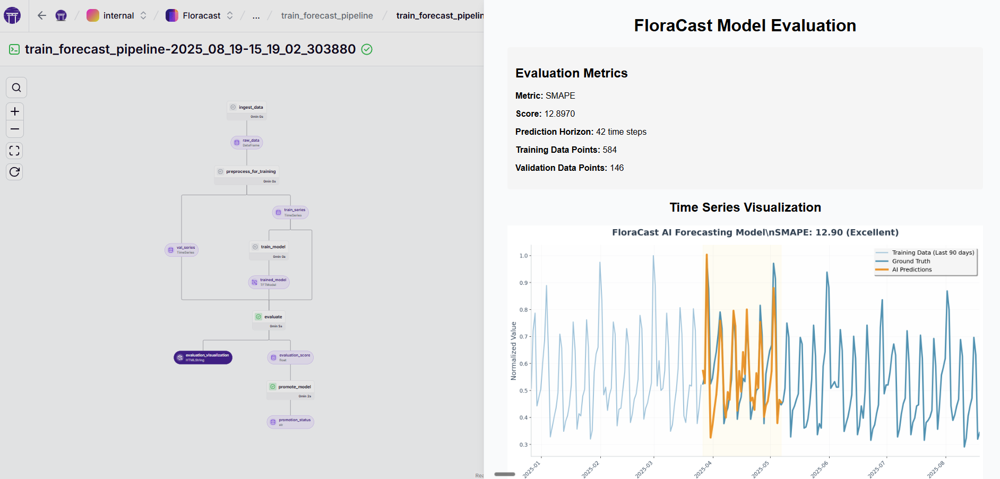
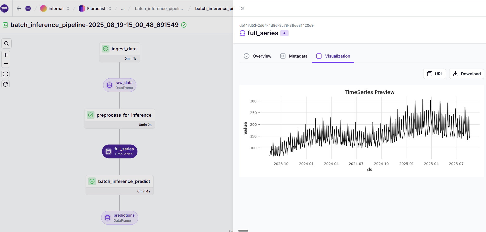
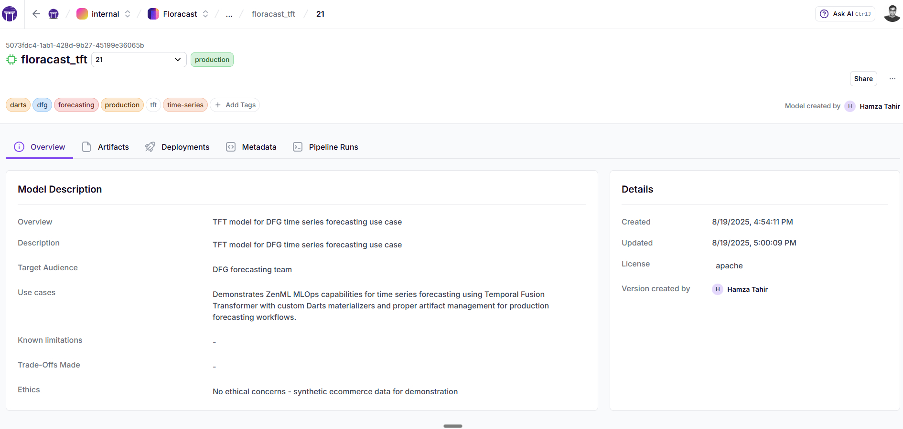

# 🌸 FloraCast

A production-ready MLOps pipeline for **timeseries prediction** and **forecasting** using ZenML and [Darts](https://unit8co.github.io/darts/index.html), designed for enterprise demand and sales forecasting across retail, e-commerce, and supply chain use cases.

## 🚀 Product Overview

FloraCast demonstrates how to build end-to-end MLOps workflows for time series forecasting. Built with ZenML's robust framework, it showcases enterprise-grade machine learning pipelines that can be deployed in both development and production environments.

Focus: **Timeseries Prediction** and **Forecasting**.

### Key Features

- **End-to-End Timeseries Prediction & Forecasting Pipeline**: From data ingestion to batch inference on a schedule.
- **Darts Integration**: Support for advanced forecasting models like [TFT (Temporal Fusion Transformer)](https://unit8co.github.io/darts/generated_api/darts.models.forecasting.tft_model.html)
- **Custom Materializers**: Production-ready artifact handling with visualizations
- **Model Versioning**: Track and compare different model versions
- **Flexible Configuration**: YAML-based configuration for different environments
- **Cloud Ready**: Built with EKS/GKE/AKS deployment in mind

## 💡 How It Works

### ✈️ Pipelines 

FloraCast consists of two main pipelines:

#### 1. Training Pipeline

The training pipeline handles the complete ML workflow:

1. **Data Ingestion** - Loads ecommerce sales data (synthetic by default)
2. **Preprocessing** - Converts to Darts TimeSeries with train/validation split  
3. **Model Training** - Trains TFT model with configurable parameters
4. **Evaluation** - Computes SMAPE metrics on validation set


*FloraCast achieves excellent forecasting performance with SMAPE scores under 13, showing AI predictions closely tracking ground truth data.*

#### 2. Batch Inference Pipeline

The inference pipeline generates predictions using trained models:

1. **Data Ingestion** - Loads new data for predictions
2. **Preprocessing** - Applies same transformations as training
3. **Batch Inference** - Generates forecasts and saves to CSV


*Automated batch inference generates future predictions on a schedule, enabling proactive business planning and inventory management.*

### 🔧 Architecture


*Complete system architecture showing data flow through ZenML pipelines, from raw data ingestion to model training, evaluation, and automated batch inference.*


*FloraCast leverages ZenML's Model Control Plane for enterprise-grade model versioning, lineage tracking, and automated deployment workflows.*
## 📦 Installation

### Prerequisites

- Python 3.9+
- [Deployed ZenML](https://docs.zenml.io/deploying-zenml/deploying-zenml)
- Virtual environment (recommended)

### Setup

1. **Clone the repository** (if part of zenml-projects):
```bash
cd zenml-projects/floracast
```

2. **Create virtual environment**:
```bash
python -m venv venv
source venv/bin/activate  # On Windows: venv\\Scripts\\activate
```

3. **Install dependencies**:
```bash
pip install -r requirements.txt
```

## ⚡ Quick Start

### Local Development

1. **Run training pipeline**:
```bash
python run.py --config configs/training.yaml --pipeline train
```

2. **Run inference pipeline**:
```bash  
python run.py --config configs/inference.yaml --pipeline inference
```

3. **View results**:
- Check the predictions artifact for predictions
- Use ZenML dashboard to view artifacts and metrics

## ⚙️ Configuration Files

FloraCast uses semantically named configuration files for different deployment scenarios:

### Available Configurations

- **`configs/training.yaml`** - Local development and training pipeline configuration
- **`configs/inference.yaml`** - Batch inference pipeline configuration for production models  

### Customization Options

Edit the appropriate config file to customize:

- **Model parameters**: TFT hyperparameters, training epochs
- **Data settings**: Date columns, frequency, validation split
- **Evaluation**: Forecasting horizon, metrics
- **Output**: File paths and formats

```
floracast/
├── README.md
├── requirements.txt
├── .env.example
├── configs/
│   ├── training.yaml            # Training pipeline config
│   └── inference.yaml           # Inference pipeline config
├── data/
│   └── ecommerce_daily.csv      # Example input data
├── pipelines/
│   ├── train_forecast_pipeline.py      # Training pipeline definition
│   └── batch_inference_pipeline.py     # Batch inference pipeline definition
├── steps/
│   ├── ingest.py                # Data ingestion step
│   ├── preprocess.py            # Preprocessing step (train/val split, scaling)
│   ├── train.py                 # Model training step
│   ├── evaluate.py              # Model evaluation step
│   ├── promote.py               # Model registration/promotion step
│   ├── batch_infer.py           # Batch inference step
│   └── load_model.py            # Model loading utilities
├── materializers/
│   ├── tft_materializer.py              # Custom TFTModel materializer
│   └── timeseries_materializer.py       # Custom TimeSeries materializer
├── utils/
│   └── metrics.py               # Forecasting metrics (e.g., SMAPE)
└── run.py                      # CLI entry point for running pipelines
```

### Key Components

- **Custom Materializers**: Proper serialization for Darts TimeSeries with visualizations
- **Flexible Models**: TFT primary, ExponentialSmoothing fallback
- **Comprehensive Logging**: Detailed pipeline execution tracking
- **Artifact Naming**: Clear, descriptive names for all pipeline outputs

## 🚀 Production Deployment

### ZenML Azure Stack Setup

To run FloraCast on Azure with ZenML, set up a ZenML stack backed by Azure services:

- **Artifact Store**: Azure Blob Storage
- **Container Registry**: Azure Container Registry (ACR)
- **Orchestrator**: Kubernetes Orchestrator targeting AKS
- **Optional**: AzureML Step Operator for managed training; Azure Key Vault for secrets

Quick start (CLI):

```bash
# Artifact Store (Azure Blob)
zenml artifact-store register azure_store --flavor=azure \
  --account_name=<AZURE_STORAGE_ACCOUNT> \
  --container=<AZURE_STORAGE_CONTAINER>

# Container Registry (ACR)
zenml container-registry register azure_acr --flavor=azure \
  --uri=<ACR_LOGIN_SERVER>

# Orchestrator (AKS via Kubernetes)
zenml orchestrator register aks_k8s --flavor=kubernetes \
  --kubernetes_context=<AKS_KUBE_CONTEXT> \
  --namespace=<NAMESPACE>

# (Optional) AzureML Step Operator
zenml step-operator register azureml_ops --flavor=azureml \
  --subscription_id=<SUBSCRIPTION_ID> \
  --resource_group=<RESOURCE_GROUP> \
  --workspace_name=<AML_WORKSPACE>

# Compose the stack
zenml stack register azure_aks_stack \
  -a azure_store -c azure_acr -o aks_k8s --set
```

Read more:

- **Set up an MLOps stack on Azure**: [ZenML Azure guide](https://docs.zenml.io/stacks/popular-stacks/azure-guide)
- **Kubernetes Orchestrator (AKS)**: [Docs](https://docs.zenml.io/stacks/stack-components/orchestrators/kubernetes)
- **Azure Blob Artifact Store**: [Docs](https://docs.zenml.io/stacks/stack-components/artifact-stores/azure)
- **Azure Container Registry**: [Docs](https://docs.zenml.io/stacks/stack-components/container-registries/azure)
- **AzureML Step Operator**: [Docs](https://docs.zenml.io/stacks/stack-components/step-operators/azureml)
- **Terraform stack recipe for Azure**: [Hashicorp Registry](https://registry.terraform.io/modules/zenml-io/zenml-stack/azure/latest)


## 🔬 Advanced Usage

### Custom Data Sources

Replace the default ecommerce data:

1. **Update configuration**:
```yaml
# configs/training.yaml
steps:
  ingest_data:
    parameters:
      data_source: "csv"          # or "ecommerce_default"
      data_path: "path/to/your/data.csv"
      datetime_col: "timestamp"
      target_col: "sales"
  preprocess_for_training:
    parameters:
      datetime_col: "timestamp"
      target_col: "sales"
      freq: "D"
      val_ratio: 0.2
```

```yaml
# configs/inference.yaml
steps:
  ingest_data:
    parameters:
      data_source: "csv"
      data_path: "path/to/your/data.csv"
      datetime_col: "timestamp"
      target_col: "sales"
  preprocess_for_inference:
    parameters:
      datetime_col: "timestamp"
      target_col: "sales"
      freq: "D"
```

2. **Ensure data format**:
   - DateTime index column
   - Numeric target variable  
   - Daily frequency (or update `freq` parameter)

### Model Experimentation

Try different forecasting models by updating the config:

```yaml
# configs/training.yaml
steps:
  train_model:
    parameters:
      model_name: "ExponentialSmoothing"  # Switch from TFT to ES
      # Note: ExponentialSmoothing uses default params in code currently
```

### Custom Metrics

Extend `utils/metrics.py` to add additional forecasting metrics:

```python
from typing import Union
import numpy as np
from darts import TimeSeries

def mase(actual: Union[TimeSeries, np.ndarray], predicted: Union[TimeSeries, np.ndarray]) -> float:
    """Mean Absolute Scaled Error (example stub)."""
    # Implement MASE here
    return 0.0
```

Update `steps/evaluate.py` to import and route to the new metric:

```python
from utils.metrics import smape, mase

# ... inside evaluate(...)
if metric == "smape":
    score = smape(actual, predictions_for_eval)
elif metric == "mase":
    score = mase(actual, predictions_for_eval)
else:
    raise ValueError(f"Unknown metric: {metric}")
```

Then configure the metric in your training config (after updating `evaluate`):

```yaml
# configs/training.yaml
steps:
  evaluate:
    parameters:
      metric: "mase"
```

## 🤝 Contributing

FloraCast follows ZenML best practices and is designed to be extended:

1. **Add New Models**: Extend `steps/train.py` with additional Darts models
2. **Custom Materializers**: Create materializers for new data types  
3. **Additional Metrics**: Expand evaluation capabilities
4. **New Data Sources**: Add support for different input formats

## 📝 Next Steps

After running FloraCast successfully:

1. **Explore ZenML Dashboard**: View pipeline runs, artifacts, and metrics
2. **Experiment with Models**: Try different TFT configurations
3. **Add Real Data**: Replace synthetic data with your forecasting use case
4. **Deploy to Production**: Use AKS configuration for scale

## 🆘 Troubleshooting

### Common Issues

**TFT Training Fails**:
- Check `add_relative_index: true` in configuration  
- Verify sufficient data length (>30 points for input_chunk_length=30)

**Materializer Errors**:
- Ensure datetime columns are properly formatted
- Check that TimeSeries can be created from your data

**Memory Issues**:
- Reduce `batch_size` or `hidden_size` in model parameters
- Use ExponentialSmoothing for lighter resource usage

## 📚 Resources

- [ZenML Documentation](https://docs.zenml.io/)
- [Darts Documentation](https://unit8co.github.io/darts/)
- [Azure ML Documentation](https://docs.microsoft.com/en-us/azure/machine-learning/)

---

Built with ❤️ using [ZenML](https://zenml.io) - *The MLOps Framework for Production AI*